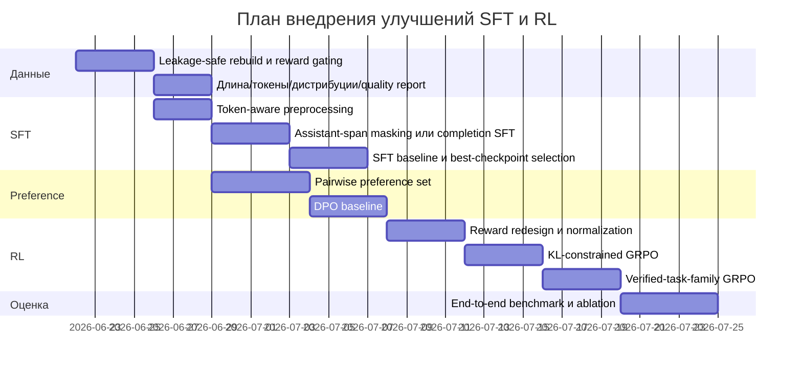

# Аудит дообучения Qwen3-VL-8B-Instruct-scireason

## Executive summary

Я проанализировал предоставленные архивы репозитория и отчётов, а также публичные артефакты датасета `top-papers/top-papers-graph-experts-data` и модели `top-papers/Qwen3-VL-8B-Instruct-scireason`. Главный вывод такой: **SFT-стадия уже доведена до рабочего состояния и даёт нормальное, хотя и не оптимальное обучение, а основная системная проблема находится в RL-стадии GRPO — почти весь reward-сигнал вырожден, KL-constraint фактически отсутствует, а reward-функции плохо согласованы с реальным распределением задач и данных**. Это означает, что опубликованный адаптер выглядит скорее как результат “рабочего SFT + частично полезного, но слабоинформативного GRPO”, а не полноценного сильного RLHF/RLAIF-контура. citeturn16view0turn16view1turn9view0turn9view1turn0search1turn0search3

Вторая ключевая проблема — **несоответствие между тем, как датасет выглядит в Hugging Face Viewer, и тем, как он реально используется в обучении**. Viewer показывает imagefolder-датасет на 1,866 строк и 215 классов, но сама модель обучалась не на этом представлении, а на экспортированных `sft.jsonl` и `grpo.jsonl` в `exports/colab-run-001`; в опубликованных артефактах модели лежат производные `sft_train/eval` и `grpo_train/eval`. Это важный источник путаницы: если оценивать баланс классов и свойства выборки по Viewer, можно прийти к неправильным выводам о реальном пайплайне. citeturn2view0turn7view0turn6view0turn3view0

Третий вывод — **данные и препроцессинг были исторически хрупкими**, и это подтверждается целой цепочкой исправлений в репозитории: `assistant_only_loss` для VLM, DDP unused parameters, потеря колонки `images` на eval, `images=None` в GRPO, рассинхрон image placeholders против числа картинок, жёсткий chat template fail, zero-loss smoke GRPO. Большая часть этих дефектов уже починена, но сама их концентрация указывает, что текущему стеку не хватает более жёстких quality gates и воспроизводимого validation pipeline перед запуском дорогостоящего обучения. citeturn22view0turn24view0turn24view1turn24view2turn24view3turn24view4turn24view5turn24view6

Практический вывод по стратегии: **для следующей итерации я бы сместил центр тяжести с “ещё одного GRPO поверх текущих reward-функций” на более строгий data curation + leakage-safe split + SFT cleanup + preference stage через DPO/IPO/cDPO, а GRPO оставил только для подзадач с верифицируемым, высоко-дисперсным reward**. Для текущего проекта это почти наверняка даст лучший ROI, чем попытка “докручивать” существующий GRPO без изменения reward design. DPO существенно проще и стабильнее PPO/RLHF, а GRPO по документации TRL и по исходной работе DeepSeekMath эффективен именно там, где внутри группы генераций есть реальное различие по reward и где reward хорошо специфицирован. citeturn25search2turn25search14turn25search0turn0search1turn25search1

## Область аудита и доказательная база

Публичный model card модели прямо говорит, что это артефакты **DataSphere SFT + GRPO pipeline**, построенные на базе `Qwen/Qwen3-VL-8B-Instruct`, а в репозитории модели сохранены корневой финальный GRPO adapter, отдельный SFT adapter, GRPO output, сгенерированные JSONL и отчёты. Это удобно для аудита, потому что критические артефакты обучения опубликованы рядом с моделью. citeturn3view0turn4view0turn5view1turn6view0turn6view1

Для датасета важно различать два уровня представления. На верхнем уровне Hugging Face показывает imagefolder-view: `validation`, 1,866 строк, 215 классов. Но в файловом дереве этого же датасета есть `exports/colab-run-001`, где лежат настоящие обучающие файлы `sft.jsonl`, `grpo.jsonl`, `export_summary.json`, `README.md` и assets; именно на них опирается обучающий пайплайн модели. README экспорта явно говорит, что `sft.jsonl` и `grpo.jsonl` созданы автоматически из экспертных отправок Task 1 и Task 2 и предназначены для научного reasoning, а не для простой image classification. citeturn2view0turn4view1turn5view0turn6view2turn7view0turn12view8turn13view0turn13view2

Ниже — компактная сводка фактически использованных артефактов обучения. Значения в таблице взяты из опубликованных конфигов и итоговых артефактов модели. citeturn17view0turn18view0turn12view2turn12view3turn10view0turn10view1turn10view2

| Компонент | Что реально использовалось |
|---|---|
| Базовая модель | `Qwen/Qwen3-VL-8B-Instruct` |
| SFT train/eval | `artifacts/data/sft_train.jsonl`, `artifacts/data/sft_eval.jsonl` |
| RL train/eval | `data/derived/hf_top_papers_graph_experts/grpo_train.jsonl`, `grpo_eval.jsonl` |
| SFT режим | VLM LoRA SFT |
| RL режим | VLM GRPO поверх SFT adapter |
| Публично сохранено | финальный GRPO adapter в корне репозитория модели + полные артефакты в `artifacts/` |

Есть и важное ограничение аудита. Большие JSONL-файлы в Hugging Face хранятся через Xet и не рендерятся целиком в веб-интерфейсе, поэтому я смог надёжно извлечь **сводки, размеры, метрики, конфиги и схемы**, но не полный почтовый разбор каждого примера из опубликованных Xet-файлов через веб. Там, где полный пример строки не был доступен, я явно указываю, что делаю вывод по summary/README/конфигам, а не по полному содержимому JSONL. citeturn10view1turn10view2turn11view0turn11view2

## Технический аудит данных, препроцессинга и обучения

### Данные и разбиения

Экспорт датасета содержит **2,548 SFT-строк** и **1,960 GRPO-строк**. По SFT он объединяет два поддатасета: `trajectory_reasoning` и `assertion_reconstruction`. В summary производных данных модели видно, что SFT после разбиения даёт 2,293 train и 255 eval; по task family там 1,428 `assertion_reconstruction` и 1,120 `trajectory_reasoning`. Для GRPO опубликованный экспорт summary показывает 1,960 строк `assertion_review_rl`; иных RL task family в экспортной сводке не видно. Это уже намекает на узкое место: RL-стадия учится почти на одном типе задачи и, вероятно, на существенно более узком reward manifold, чем SFT. citeturn11view5turn13view2turn12view0turn12view1

Ещё важнее мультимодальная часть. В summary производных данных модели указано, что для SFT число image refs было урезано с **3,291 до 1,334**, и **430 строк** потеряли часть изображений из-за cap; для GRPO урезание ещё жёстче: с **12,046 до 3,206**, причём **1,603 строки** были усечены по числу изображений. Такой масштаб усечения означает не косметическое упрощение, а реальную смену информационной плотности примеров. Для VLM reasoning это рискованно: reward и answer fidelity могут зависеть именно от тех страниц, таблиц и фигур, которые были отброшены. citeturn12view1

### Препроцессинг, токенизация и мультимодальный формат

SFT run-config показывает, что обучение шло в режиме `train_mode="vlm"`, с `assistant_only_loss=false`, `max_length=null`, `max_text_chars=12000`, `max_pixels=1003520`, `lora_target_modules="all-linear"` и `ddp_find_unused_parameters=true`. Дополнительно из train/eval были удалены длинные строки: **64 train** и **6 eval**. Это говорит о том, что фильтрация длин строилась не на токенах, а на предварительном text-char gate. Такой подход рабочий, но для JSON-heavy и multimodal prompts он хуже токен-ориентированного budget control, потому что символы и токены расходятся непредсказуемо, особенно на смешанном русском/английском тексте, JSON и табличных фрагментах. citeturn18view0turn18view5turn18view6

То, что `assistant_only_loss=false`, в текущем виде не выглядит явной ошибкой, а скорее вынужденным компромиссом. Официальные документы TRL говорят, что `assistant_only_loss=True` требует корректного chat template с generation tags, а в экосистеме TRL есть отдельные сообщения о том, что для vision-language models эта опция ещё не поддерживается как полноценный стандартный путь. В репозитории проекта это также зафиксировано как историческая причина падения smoke-run и последующей принудительной деактивации флага для VLM SFT. Но с точки зрения качества это всё равно минус: модель обновляется не только на ответе, но и на токенах системного и пользовательского контекста, что может размывать полезный learning signal. citeturn0search4turn0search8turn22view0

История с форматом изображений тоже принципиальна. В репозитории отдельно задокументировано, что legacy export раньше создавал `chat` и `prompt_chat` без стабильного top-level `images`, из-за чего train-скрипты могли ошибочно распознать датасет как text-only. Отдельно фиксировались ошибки с потерей `images` на eval, несоответствием числа image placeholders фактическому числу картинок и падением GRPO на `images=None`. Формально это уже исправленные баги, но для аудита это означает, что **данные надо считать недоверенными до прохождения строгой multimodal validation**, а не просто “валидными по схеме JSONL”. citeturn24view1turn24view3turn24view5turn24view9

### SFT-стадия

SFT-стадия обучалась 480 шагов и завершилась успешно. Итоговые метрики SFT выглядят так: `train_loss=1.603`, `eval_loss=1.232`, `eval_mean_token_accuracy=0.741`, `train_examples=2229`, `eval_examples=249`. По логам `trainer_state.json` eval loss снижался примерно от **1.513 на step 60** до **1.230 на step 420** и **1.232 на step 480**, а eval mean token accuracy рос от **0.686** до примерно **0.742**. Это похоже на нормальное сходимое SFT без явного катастрофического переобучения. Скорее видно плато после ~step 360–420, чем overfit. citeturn16view0turn16view1turn17view7turn19view2turn19view3turn19view4turn19view5turn19view6turn19view7turn19view8turn20view0

При этом инфраструктурно SFT всё ещё неидеален. В `trainer_state.json` и у SFT, и у GRPO `best_global_step`, `best_metric`, `best_model_checkpoint` остаются `null`. То есть best-checkpoint selection фактически не использовался. Для экспериментов это неудобно: откат, сравнение и репродукция становятся хуже, а финальная публикация по сути жёстко привязана к last checkpoint, даже если earlier checkpoint был лучше по eval. citeturn17view1turn12view4

### RL-стадия GRPO

Финальный GRPO конфиг у модели: `learning_rate=1e-5`, `max_steps=120`, `per_device_train_batch_size=1`, `gradient_accumulation_steps=8`, `num_generations=4`, `num_generations_eval=2`, `max_completion_length=512`, `warmup_ratio=0.08`, `optim=adamw_torch_fused`, `weight_decay=0.0`, `max_grad_norm=0.3`, `sft_adapter_path=outputs/hf_top_papers_qwen3vl_8b_sft_lora`, `train_mode="vlm"`. Важнейшая деталь: в сохранённом planned config нет явного поля `beta`, а в `trainer_state.json` нет логов `kl` или `beta`; официальная документация TRL указывает, что `beta` в `GRPOConfig` по умолчанию равен **0.0**, что означает отсутствие загрузки reference model и отсутствие KL-регуляризации в стандартном виде. Для alignment-фазы это один из самых критичных архитектурных недостатков текущего контура. citeturn12view2turn12view3turn14view0turn14view1turn0search3

Сами финальные GRPO-метрики подтверждают, что полезный RL-сигнал слабый. Итоговый `eval_loss` почти нулевой по модулю, `eval_reward≈0.3575`, но одновременно `eval_frac_reward_zero_std≈0.988`. Это означает: почти во всех eval-группах reward внутри группы генераций почти не различается, и advantage в GRPO становится почти вырожденным. Ещё хуже то, что reward-компоненты распределены очень неравномерно: `reward_evidence_presence` и `reward_schema_validity` почти насыщены около 0.99, `reward_graph_consistency` и `reward_label_exact_match` равны нулю, а `reward_expert_override_match` почти константно отрицателен около -0.75. Такая картина типична для плохо отмасштабированного composite reward, где часть слагаемых всегда “в потолке”, часть всегда “в полу”, а часть вообще неактивна. GRPO при этом почти нечего оптимизировать. citeturn9view0turn9view1turn14view3turn14view4turn14view5turn14view6turn14view7turn14view8

Промежуточные train-метрики подтверждают тот же диагноз. Уже в ходе обучения встречаются шаги с `frac_reward_zero_std=0.6`, потом `0.8`, а на поздних этапах видны эпизоды `grad_norm=0.0`. Репозиторий проекта отдельно фиксирует такую проблему как “weak GRPO signal”, а в smoke-версии ранее наблюдался классический zero-loss режим: `loss=0`, `grad_norm=0`, `completions/clipped_ratio=1.0`, `reward_std=0`. Хотя финальный full-run лучше smoke-run, системный класс проблемы никуда не исчез: reward остаётся слишком малоинформативным. citeturn14view2turn13view8turn24view4turn24view7

Ниже — компактное сравнение реально использованных параметров и фактических симптомов. Все значения взяты из опубликованных артефактов модели. citeturn18view0turn12view2turn16view0turn9view0turn24view7

| Параметр | SFT | GRPO | Комментарий |
|---|---:|---:|---|
| Train / eval examples | 2229 / 249 | 1438 / 165 | RL выборка заметно меньше |
| LR | 7e-5 | 1e-5 | Для RL осторожно, но reward слабый |
| Steps | 480 | 120 | RL короткий и с вырожденным signal |
| `assistant_only_loss` | false | — | Для VLM сейчас вынуждено, но не идеально |
| `max_length` | null | `max_completion_length=512` | SFT живёт на char gate, не на token budget |
| `ddp_find_unused_parameters` | true | resolved flag сохраняется | Отдельный overhead в отчётах |
| KL / beta | — | не задано явно | По TRL default вероятно `beta=0.0` |
| Best checkpoint selection | null | null | Нет выбора лучшего чекпоинта |
| Итоговый сигнал | eval loss улучшается | reward variance почти вырождена | Основной bottleneck — RL |

## Ключевые ошибки и узкие места

### Главные проблемы, которые уже доказаны артефактами

Наиболее серьёзная проблема — **вырождение reward-сигнала в GRPO**. По сути вы одновременно наблюдаете три аномалии: почти нулевую внутригрупповую дисперсию reward, насыщение части reward-компонент и неработающие/неактивные другие компоненты. Для GRPO это почти худший сценарий: алгоритм зависит от сравнительного преимущества внутри группы генераций. Если группы почти неразличимы, обучение вырождается в дорогую имитацию RL без meaningful update. citeturn9view0turn14view2turn14view3turn14view5turn24view7

Вторая фундаментальная проблема — **отсутствие явной KL-регуляризации**. Это не обязательно ломает обучение мгновенно, но делает RL-стадию менее управляемой и менее репродуцируемой. Официальный `GRPOConfig` в TRL документирует `beta` с default `0.0`; если `beta=0`, reference model не загружается, что экономит память, но одновременно убирает важный стабилизатор policy drift. В текущем проекте отсутствие `beta` и `kl` в артефактах выглядит не как случайная мелочь, а как системное архитектурное упрощение, которое ухудшает качество RL alignment. citeturn0search3turn12view2turn14view0turn14view1

Третья проблема — **слишком агрессивное усечение мультимодального контекста**. Для GRPO 1,603 строки из 1,960 потеряли часть image refs после cap. Если reward зависит от доказательной базы на страницах/таблицах/рисунках, такое усечение может сделать reward noisy или даже structurally wrong: модель наказывается или награждается за ответ, который уже невозможно восстановить из усечённого контекста. Это особенно опасно, если verdict reward рассчитывается против “правильного” ответа, сформированного по более полному evidence set, чем тот, что реально видит policy. citeturn12view1

Четвёртая проблема — **слабая task diversity в RL**. Экспорт summary показывает только `assertion_review_rl` в объёме 1,960 строк. Это означает, что весь GRPO-контур фактически специализируется на одной family. В результате reward-компоненты, предназначенные для других family, становятся мёртвыми, а policy learning сужается до одного формата поведения. Для alignment это бедно: легче переоптимизироваться под шаблон review JSON, чем реально улучшить научное рассуждение. citeturn11view5

### Технические дефекты пайплайна, которые уже были исторически обнаружены

Ниже — самые важные ошибки, зафиксированные репозиторием и/или артефактами, с оценкой, что для вас критично сейчас. citeturn22view0turn24view0turn24view1turn24view2turn24view3turn24view4turn24view5turn24view6turn24view7turn24view9

| Ошибка / узкое место | Доказательство | Статус | Почему это важно |
|---|---|---|---|
| `assistant_only_loss=True` ломал VLM SFT | hard fail в smoke-run | Исторически исправлено | Показывает, что loss masking для VLM не был продуман изначально |
| DDP unused parameters | DDP падал на первом step; позже флаг давал лишний overhead | Частично исправлено, но overhead оставался | Снижает эффективность и усложняет воспроизводимость |
| Потеря `images` на eval | `KeyError: 'images'` | Исправлено | Доказывает хрупкость dataset preparation |
| GRPO `num_generations=1` | hard fail GRPO | Исправлено | Базовый config hygiene отсутствовал |
| `images=None` в GRPO | падение Qwen3-VL processor | Исправлено | Смешанные text/VLM батчи были невалидны для GRPO |
| Рассинхрон placeholders и изображений | `Number of images provided ... does not match ... placeholders` | Исправлено | Препроцессинг multimodal сообщений был нестабилен |
| Zero-loss smoke GRPO | `loss=0`, `grad_norm=0`, `reward_std=0` | Smoke исправлялся, но класс проблемы остался | Прямой сигнал неинформативного reward design |
| `NameError` на сохранении чекпоинта в GRPO | указан в training efficiency report | Исправлено | Низкая reliability конца пайплайна |
| Legacy `chat/prompt_chat` без top-level `images` | train scripts могли уходить в text-only mode | Исправлено | Опасная ошибка маршрутизации modality |

### Что я считаю вероятными, но не полностью доказанными проблемами

Здесь я отмечу именно **предположения**, как вы просили — без выдумывания чисел.

Я считаю очень вероятной проблему **data leakage на старом варианте сборки датасета**, потому что текущие артефакты модели используют старый `source_mode="export"` и старые пути `sft_train.jsonl` / `grpo_train.jsonl`, тогда как в загруженном архиве репозитория присутствует более поздний builder с leakage-safe group split и reward-ready verified GRPO subsets. Я не утверждаю, что leakage в опубликованной модели точно произошёл, но полагаю, что **опубликованный адаптер, скорее всего, ещё не обучался на более строгом leakage-safe v2 pipeline**. Это нужно проверить отдельно на фактических JSONL из архива или при следующей сборке. citeturn11view0turn12view2turn3view0

Также вероятна проблема **несогласованности reward со смыслом задачи**. Почти константный отрицательный `reward_expert_override_match` около `-0.75` означает либо систематический промах модели по verdict semantics, либо плохое сопоставление label space / schema keys / expected fields между датой, разметкой и reward code. Без полного просмотра `grpo_reward_trace.jsonl` и пер-example JSONL я не могу доказать, какая именно из этих причин доминирует, но симптом слишком выраженный, чтобы списать его на случайность. citeturn9view0turn14view5

## Конкретные исправления и SOTA-улучшения

### Что бы я изменил в SFT

Для SFT я бы не “ломал” текущий контур, а **перевёл его на более строгую и более современную организацию сигнала**. Первое — перейти от char-based фильтра к token-budget aware preprocessing с отчётом о длинах prompt/answer/image tokens по split и task family. Сейчас `max_length=null`, а ограничение идёт через `max_text_chars=12000`; это удобно для быстрого запуска, но плохо контролирует реальную нагрузку на контекст. Второе — если стандартный `assistant_only_loss` для VLM всё ещё нестабилен, я бы использовал **completion-style formatting или собственную loss mask разметку для assistant spans**, чтобы не обучать модель на пользовательских и системных токенах. Официальный SFTTrainer рекомендует `assistant_only_loss=True` именно для такого разделения, но для VLM this path пока требует осторожности; значит, нужен контролируемый кастомный masking path, а не полный отказ от masking как идеи. citeturn18view0turn0search2turn0search4turn0search8

Третье — нужно добавить **best-checkpoint selection по релевантной eval-метрике**, а не публиковать last checkpoint по умолчанию. Для SFT здесь разумно сохранять минимум `eval_loss`, `eval_mean_token_accuracy` и task-aware structural metrics на held-out sets. Четвёртое — я бы разделил SFT на **curriculum**: сначала text-only SFT на reasoning JSON without images, затем multimodal SFT только на rows с доказательно полезными images, затем short-format instruction SFT для stable JSON emission. Для reasoning VLM это обычно даёт более чистую learning dynamics, чем сразу обучать всё вперемешку одинаковым образом. citeturn16view0turn16view4turn0search2

### Что бы я изменил в preference / RL слое

Для следующей итерации я рекомендую **сделать DPO или cDPO промежуточной основной alignment-стадией, а GRPO оставить только как узкоспециализированный верхний слой**. DPO по исходной работе даёт более простой и часто более стабильный путь к preference alignment, чем классический RLHF/PPO, потому что не требует online sampling + RM + RL-loop в полном виде. В вашем случае это особенно логично, потому что reward уже сейчас выглядит слабым, а pairwise preference stage может быть построен из экспертных ревью и synthetic/hard-negative pairs заметно надёжнее, чем текущий composite reward. citeturn25search2turn25search14

Если GRPO сохранять, то его надо перестроить почти по всем основным осям:

| Направление | Что менять | Зачем |
|---|---|---|
| Reward design | task-specific routing вместо общего reward vector для всех family | убрать мёртвые reward-компоненты |
| Reward scaling | z-score / robust normalization per component, per batch or rolling window | не давать schema/evidence saturate и доминировать |
| KL control | задать ненулевой `beta`, логировать KL | ограничить drift и стабилизировать policy |
| Group signal | увеличить diversity генераций внутри группы, проверять reward variance | без этого GRPO не работает как задумано |
| Dataset gating | запускать RL только на reward-ready + ambiguity-rich rows | не тратить compute на “лёгкие” или шумные примеры |
| Completion control | structured decoding / constrained JSON / longer completion budgets | убрать вырожденные clipped, malformed completions |

Почему это критично. TRL описывает GRPO как алгоритм, где на каждом шаге создаётся группа completion’ов, затем по reward вычисляется advantage, затем учитывается KL и loss. Если reward внутри группы не различает ответы, advantage вырождается. Если `beta=0`, пропадает референсный якорь. Если structured output задан слабо, reward начинает измерять в основном валидность JSON, а не качество reasoning. Именно это сейчас и видно в артефактах модели. citeturn0search1turn0search3turn25search0turn9view0turn14view2

### Что бы я изменил в reward modeling

Наиболее сильная стратегическая рекомендация — **перестать полагаться только на hand-coded procedural rewards для open-ended scientific reasoning**. Для узких подзадач вроде проверки JSON schema, наличия evidence field или простого exact-match procedural reward уместен. Но для более сложных verdict/rationale/evidence consistency задач нужен отдельный **reward model или хотя бы pairwise verifier**, обученный на человеческих предпочтениях и проверенный на reward benchmark-style оценке. RewardBench показывает, что качество reward models само по себе требует отдельной оценки; open-source reward modeling без полноценной валидации часто становится скрытым bottleneck всего alignment-пайплайна. citeturn25search3turn25search15turn25search11

Практически я бы делал так:

1. строил pairwise preference set на основе экспертных review;  
2. обучал отдельный RM или использовал implicit preference objective вроде DPO/cDPO;  
3. валидировал RM на внутреннем held-out set с разбиением по task family, domain, image density и длине;  
4. только затем запускал GRPO/RL для тех задач, где reward model или verifier реально различает хорошие и плохие ответы.

Для multimodal части это особенно важно, потому что финансово дорогое RL поверх VLM хуже всего переносит weak reward design. citeturn25search1turn25search2turn25search3turn25search19

## План экспериментов и приоритет внедрения

### Рекомендуемые контрольные группы

Я бы строил следующий экспериментальный план. Он компактный, но покрывает все основные риски. Критерии успеха в таблице — это **целевые значения для следующей итерации**, а не утверждение, что они уже достигнуты. Текущие базовые уровни взяты из опубликованных артефактов. citeturn16view0turn9view0turn18view0turn12view2

| Эксперимент | Базовая линия | Изменение | Основные метрики | Критерий успеха |
|---|---|---|---|---|
| SFT token-budget cleanup | текущий SFT | token-aware filtering + length histograms + best checkpoint | eval_loss, token acc, drop rate, GPU util | `eval_loss < 1.20`, drop rate < 1.5% |
| SFT loss masking | текущий SFT без assistant-only masking | custom assistant-span masking / completion-only formatting | eval_loss, response quality, JSON validity | +1–2 п.п. accuracy или same loss при лучшем answer fidelity |
| DPO preference stage | SFT-only | SFT → DPO на pairwise review data | pairwise win-rate, structural conformity | >55–60% preference win-rate vs SFT |
| GRPO with KL | текущий GRPO | ненулевой `beta`, KL logging, per-task rewards | eval_reward, KL, zero-std fraction | `eval_frac_reward_zero_std < 0.4` |
| Reward redesign | текущий composite reward | remove dead rewards, normalize live rewards | reward variance, grad_norm, verdict match | stable nonzero grad, reward std sustained |
| Multimodal evidence budget | current caps 3/2 images | relevance-aware dynamic top-k or page-level selection | reward quality, verdict correctness | рост verdict accuracy без роста hallucination |

### Приоритеты внедрения

Ниже — мой порядок внедрения. Он отражает не “академическую полноту”, а наилучший практический ROI.

| Приоритет | Изменение | Эффект | Риск | Ресурсы |
|---|---|---|---|---|
| Высокий | leakage-safe rebuild датасета и reward-ready gating | снижает шум и leakage | низкий | 1–2 дня data engineering |
| Высокий | SFT token-aware preprocessing и best checkpointing | быстрый прирост качества/воспроизводимости | низкий | 1–2 дня |
| Высокий | убрать мёртвые reward-компоненты, ввести normalization | повышает реальный GRPO signal | средний | 2–4 дня |
| Высокий | включить KL-constraint и явное логирование KL | стабилизирует RL | средний | 1–2 дня |
| Средний | заменить текущий RL-first alignment на SFT→DPO→GRPO | резко улучшает устойчивость | средний | 1–2 недели |
| Средний | построить отдельный reward model / verifier | лучший long-term upside | высокий | 2–4 недели + разметка |
| Средний | dynamic image selection вместо жёстких caps | улучшает evidence fidelity | средний | 3–5 дней |

### Предлагаемый timeline

## Итоговые рекомендации и ограничения

Если цель — **получить наиболее эффективное дообучение по SOTA-подходам**, то мой итоговый рецепт выглядит так:

1. **Пересобрать датасет** через leakage-safe / reward-ready pipeline и сделать полноценный audit report по длинам, task family, image density, dropped rows и source groups.  
2. **Стабилизировать SFT**: token-aware budgets, assistant-span masking или completion-only target, best-checkpoint selection, curriculum text→multimodal→structured JSON.  
3. **Добавить preference stage**: SFT → DPO/cDPO как основной alignment-шаг для научного reasoning.  
4. **Оставить GRPO только там, где reward дисперсионный и проверяемый**, а не как общий alignment-mолоток для всех задач.  
5. **Ввести KL-constraint и живое логирование KL/reward variance/zero-std fraction** как обязательные quality gates для RL.  
6. **Развивать reward modeling как отдельный продукт**, а не как набор эвристик внутри train script. citeturn25search2turn25search0turn25search1turn0search1turn0search3turn25search3

По текущему состоянию я бы оценил приоритеты так:  
**не запускать новый дорогой full GRPO до тех пор, пока не будут исправлены leakage/data gating, reward routing и KL-constraint**. Самая рациональная следующая версия — это **SFT-cleanup + DPO baseline + ограниченный verified-GRPO**, а не просто “ещё один full GRPO” на тех же данных и reward-функциях. citeturn24view7turn25search2turn0search1

## Открытые вопросы и ограничения

Полный пер-example аудит `sft_train.jsonl`, `grpo_train.jsonl`, `grpo_reward_trace.jsonl` и точных распределений длин/полей в опубликованных Hugging Face Xet-файлах через веб-интерфейс недоступен в полном виде, поэтому часть выводов о качестве разметки, длинах и редких форматных аномалиях основана на summary-файлах, README, trainer states и опубликованных конфигах, а не на полном сканировании всех строк. citeturn10view1turn10view2turn11view0turn9view4

Также я не стал выдумывать точные значения для тех артефактов, которые не были опубликованы или не были полностью видимы в вебе. В частности, для окончательного вывода о наличии или отсутствии train/eval leakage в уже опубликованной модели лучше дополнительно сверить фактические uploaded JSONL из архива по source-group ключам. Пока это остаётся высоковероятной, но не полностью доказанной гипотезой. citeturn11view0turn3view0