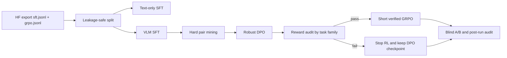
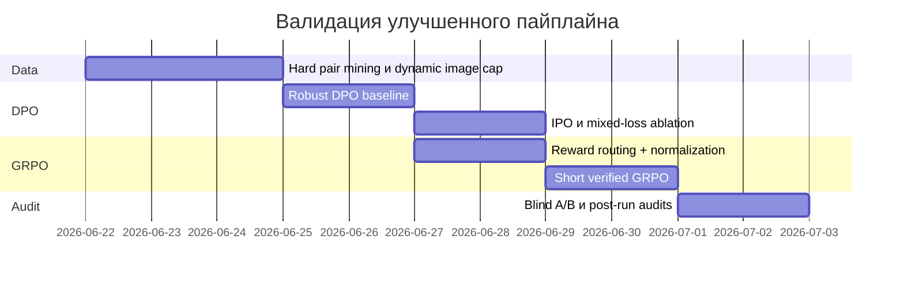

# Аудит и план усиления SFT, DPO и GRPO для SciReason

## Executive summary

Ключевой вывод по текущему состоянию репозитория и пайплайна такой: **основной bottleneck качества сейчас уже не в базовом SFT, а в том, как построены preference- и RL-стадии, особенно GRPO**. По присланным логам и ранее сформированному аудиту видно, что reward-сигнал у GRPO остаётся частично вырожденным: `frac_reward_zero_std` слишком высок, часть reward-компонент насыщена почти до константы, часть фактически “мёртвая”, а это означает, что групповой advantage у GRPO становится малоинформативным. В такой конфигурации RL-этап тратит дорогой compute, но даёт существенно меньше пользы, чем мог бы при корректном routing reward по task family, нормализации reward и более строгом gating данных. fileciteturn0file4 citeturn5view0turn5view1turn0academia0

Второй вывод: **в репозитории уже есть правильное направление развития** — переход от legacy-схемы “SFT → GRPO” к более зрелой схеме “text-SFT → VLM-SFT → DPO → short GRPO polish”. Этот вектор совпадает и с практикой TRL, и с тем, что показывает литература: DPO даёт более простой и стабильный preference-learning, чем классический RLHF/PPO-контур, а GRPO особенно полезен там, где reward действительно верифицируемый и дисперсионный внутри группы генераций. Иначе GRPO быстро вырождается в слабый, дорогой и нестабильный post-hoc polish. citeturn7academia0turn4view0turn4view1turn12academia2

Третий вывод: **для этого проекта DPO должен стать основной alignment-стадией, а GRPO — узкой, gated-надстройкой только для reward-ready подмножеств**. Практически это означает: усилить pair mining, добавить robust DPO/IPO-style режимы, сделать preference pairs более “трудными” и содержательно связанными с evidence, а GRPO запускать только после того, как reward-audit подтверждает ненулевую вариативность по активным компонентам. Это прямо соответствует тому, как TRL документирует DPO и GRPO: DPOTrainer поддерживает robust/IPO/multi-loss режимы и VLM; GRPOTrainer ожидает meaningful reward variation, а `frac_reward_zero_std` и `reward_std` являются ключевыми диагностическими метриками. citeturn6view0turn6view1turn6view2turn8view0turn5view0

Итоговая рекомендация в одной фразе: **сделать v2 DPO-first pipeline дефолтным, перевести reward-функцию GRPO на task-aware routing + robust normalization + evidence-aware scoring, добавить memory-safe collator и leakage-safe hardening, а затем валидировать всё через жёсткие fail-gates до запуска дорогого RL**. Это даст больший прирост качества и стабильности, чем любая точечная подстройка только `beta` или только `reward_weights`. fileciteturn0file4 citeturn5view1turn10view0turn12academia0

## Что сейчас ограничивает качество сильнее всего

По фактической логике текущего механизма в репозитории заметно, что **архитектурно уже сделано много правильных шагов**: есть leakage-safe builder, есть DPO-ветка, есть image capping с evidence-aware ranking, есть post-run audit reward trace, есть safe reload для PEFT checkpoint’ов, есть offline prefetch моделей. Но самые критичные ошибки остались именно в тех местах, где качество зависит не от “исправности запуска”, а от **содержательной корректности сигнала обучения**. fileciteturn0file4 citeturn9view0turn9view2turn10view0

На практике это распадается на четыре проблемы.

Первая проблема — **reward routing не совпадает с фактическим составом RL-данных**. Если в GRPO-данных доминирует один тип задач, а reward-вектор всё ещё содержит компоненты для label matching или graph reconstruction, то эти компоненты становятся либо нулевыми, либо статистически мёртвыми. В результате итоговый `reward` формально считается как weighted sum, но реально оптимизация идёт по двум-трём слабым признакам, а не по содержательному quality signal. TRL прямо логирует `reward`, `reward_std` и `frac_reward_zero_std` как главные индикаторы того, различает ли reward ответы внутри generation group. citeturn5view0turn5view4

Вторая проблема — **слишком “дешёвые” reward-компоненты доминируют над дорогими**. Если `schema_validity` и `evidence_presence` почти всегда легко получают высокий балл, а `expert_override_match` или содержательная проверка графа ведут себя редко и шумно, модель быстро учится оптимизировать формат, а не reasoning. Это типичный reward hacking на уровне hand-crafted reward design. Для RM/RLHF сообщества это не новая проблема; поэтому RewardBench отдельно подчёркивает, что качество reward model или reward design нельзя считать “само собой надёжным” — его нужно измерять как отдельный объект и отслеживать overoptimization. citeturn12academia0turn13view0

Третья проблема — **DPO-пайплайн ещё недостаточно агрессивен по качеству preference data**. DPO по своей природе очень чувствителен к качеству пар `chosen/rejected`: если negative слишком лёгкий, синтетический и шаблонный, модель быстро учится разделять “совсем плохое” и “нормальное”, но почти не учится различать “хорошее” и “отличное”. Исходная работа DPO показывает, что метод силён именно из-за прямой оптимизации pairwise preferences, без полного RL-контура; но от этого ещё важнее качество preference pairs. В TRL DPOTrainer доступны robust DPO, IPO, WPO-style weighting и multi-loss combinations — именно для того, чтобы лучше работать с шумом и неоднородностью preference data. citeturn7academia0turn6view0turn6view1turn6view4turn8view0

Четвёртая проблема — **инфраструктурная память и batching до сих пор лечатся в основном через жёсткие caps, а не через batch-aware memory control**. Для VLM это почти всегда уступающий путь: статический cap по картинкам лишь грубо режет контекст, но не контролирует реальную стоимость batch по суммарным пикселям, токенам и image slots. Документация TRL отдельно рекомендует контролировать truncation, padding, activation offloading и память через batch-aware техники; при этом `chunked_nll` хоть и хорош для SFT, прямо не подходит для PEFT/VLM, то есть его здесь нельзя просто “включить и забыть”. citeturn10view0

Ниже — сжатая матрица “текущее состояние → что менять в первую очередь”.

| Зона | Текущее состояние | Почему это плохо | Что менять первым |
|---|---|---|---|
| Reward в GRPO | Компоненты частично насыщены, частично мёртвые | Advantage почти не несёт сигнала | Task-aware routing + robust normalization |
| DPO data | Много “лёгких” или синтетических негативов | Слабый preference margin | Hard pair mining и pair weighting |
| KL / reference control | Настройка есть, но используется слишком консервативно | Drift либо избыточно слабый, либо неявный | Явный beta policy и ref-aware schedules |
| VLM memory | Опираться на fixed image cap | Потеря evidence, OOM остаётся вероятным | Memory-safe collator + dynamic image cap |
| Audit gates | Есть, но недостаточно “боевые” | Плохие прогоны всё равно стартуют | Fail-fast thresholds и DDP-safe audits |

## Приоритетные изменения в коде репозитория

Ниже — список того, что я бы менял в кодовой базе в первую очередь. Это **не абстрактные идеи**, а конкретные места репозитория, где изменение даст максимальный эффект.

### Таблица приоритетных патчей

| Файл | Узел | Что изменить | Приоритет | Ожидаемый эффект |
|---|---|---|---|---|
| `experiments/vlm_finetuning/scripts/train_vlm_grpo.py` | reward functions + aggregation | Ввести task-aware routing, robust normalization, masking inactive components, richer evidence scoring | Очень высокий | Убрать мёртвые reward-компоненты, поднять reward variance |
| `experiments/vlm_finetuning/scripts/train_vlm_grpo.py` | args / trainer config | Добавить `num_iterations`, `top_entropy_quantile`, `epsilon_high`, beta scheduling, safe GRPO best-checkpoint save | Очень высокий | Стабильнее RL и меньше бесполезных обновлений |
| `experiments/vlm_finetuning/scripts/build_scireason_alignment_datasets.py` | DPO builder | Переписать pair mining: hard negatives, cross-source negatives, model-generated negatives, evidence-drop negatives | Очень высокий | Значительно более сильный DPO |
| `experiments/vlm_finetuning/scripts/train_vlm_dpo.py` | DPO config | Добавить `precompute_ref_log_probs`, `use_weighting`, multi-loss support, explicit ref-policy mode | Очень высокий | Более устойчивое DPO на noisy pairs |
| `experiments/vlm_finetuning/scripts/train_vlm_sft.py` и `train_vlm_dpo.py` | collator / batching | Подключить memory-safe VLM collator с batch budget по пикселям и image slots | Высокий | Меньше OOM и меньше грубого усечения |
| `experiments/vlm_finetuning/datasphere/bin/run_hf_top_papers_sft_dpo_grpo_v2.sh` | orchestration | Сделать v2 default, legacy SFT→GRPO перевести в deprecated | Высокий | Правильный production entrypoint |
| `experiments/vlm_finetuning/scripts/audit_alignment_readiness.py` | quality gates | Ужесточить fail-gates по reward variance, leakage, image truncation, pair hardness | Высокий | Меньше дорогих неудачных полных прогонов |
| `tests/` | regression tests | Добавить unit tests для reward routing, pair mining, image selection, offline mode | Высокий | Стабильность пайплайна после патчей |

### Почему это надо делать именно так

DPOTrainer в TRL уже поддерживает VLM, robust loss, IPO, `label_smoothing`, `use_weighting`, multi-loss combinations, а также отдельные режимы работы с reference model и precomputed reference log-probs. То есть вам **не нужно придумывать новый пайплайн** — большая часть нужной SOTA-функциональности уже концептуально лежит очень близко к текущему коду, её нужно просто правильно открыть в CLI/конфигах и соединить с качественным data mining. citeturn6view0turn6view1turn6view2turn6view4turn8view0turn8view1

GRPOTrainer, в свою очередь, уже документирует нужные стабилизаторы: `beta`, `num_iterations`, `mask_truncated_completions`, `top_entropy_quantile`, clipping-параметры и диагностические метрики. Это важно, потому что для вашего случая не нужно “переписывать GRPO целиком”; нужно **сделать reward и examples пригодными к GRPO**, а затем включить те конфиги, которые снижают variance collapse и truncation noise. citeturn5view1turn5view2turn5view3turn8view2turn8view3turn8view4

## Как переписать reward-функцию и GRPO так, чтобы она перестала вырождаться

### Главное изменение логики reward

Сейчас reward-функция выглядит как единый глобальный вектор компонент, который одинаково применяется ко всем task family. Для SciReason это неверно. Нужен **task-aware reward routing**: активные компоненты должны зависеть от `task_family`, а не просто зануляться в конце.

Практически я бы ввёл такую схему:

| Task family | Активные reward-компоненты | Компоненты только для аудита |
|---|---|---|
| `assertion_review_rl` | `expert_override_match`, `evidence_grounding`, `schema_validity`, `temporal_consistency` | `label_exact_match`, `graph_consistency` |
| `mm_review_rl` | `expert_override_match`, `evidence_grounding`, `schema_validity` | `graph_consistency`, `label_exact_match` |
| `trajectory_reasoning_rl` | `graph_consistency`, `evidence_grounding`, `schema_validity` | `expert_override_match` |
| `image_label_rl` | `label_exact_match`, `schema_validity` | `graph_consistency`, `temporal_consistency` |
| `temporal_fix_rl` | `temporal_consistency`, `expert_override_match`, `schema_validity` | `graph_consistency` |

Это решает две проблемы сразу: inactive components не будут искусственно раздувать `frac_reward_zero_std`, а аудит начнёт честно показывать variance только по тем компонентам, которые действительно должны быть активны. Семантически это ближе к тому, как GRPO вообще должен использоваться: reward должен различать **качественно разные ответы на один и тот же prompt**, а не загрязняться глобальными нулями. citeturn5view0turn5view4turn0academia0

### Нормализация reward, которую стоит внедрить

Я рекомендую не суммировать raw rewards напрямую. Вместо этого:

\[
r^{norm}_{g,i,c} = \mathrm{clip}\left(\frac{r_{g,i,c} - \mathrm{median}(r_{g,:,c})}{\mathrm{MAD}(r_{g,:,c}) + \epsilon}, -2.5, 2.5\right)
\]

где \(g\) — prompt-group, \(i\) — генерация внутри группы, \(c\) — reward component.

Далее агрегировать так:

\[
R_{g,i} = \sum_c w_{c,task} \cdot \tanh(r^{norm}_{g,i,c} / \tau_c)
\]

Такой вариант намного лучше сырой суммы, потому что:

- не даёт `schema_validity` и `evidence_presence` доминировать только потому, что они почти всегда около 1;
- превращает редкие сильные различия по `expert_override_match` в реальный learning signal;
- уменьшает влияние выбросов и неидеальной шкалы разных reward-компонент;
- делает reward variance устойчивее именно **внутри generation group**, что критично для GRPO. citeturn5view0turn8view3

### Что именно поменять в компонентах reward

#### Schema validity

Сейчас этот компонент слишком легко насыщается. Его нужно преобразовать из “почти полноценной метрики качества” в **малый структурный gate**.

Предлагаю:

- valid JSON/object: `+0.10`
- required task keys present: `+0.05` за ключ, максимум `+0.20`
- malformed but close-to-JSON output: от `-0.10` до `0.0`
- ceiling для компонента: `0.30`

То есть структурная корректность должна **помогать**, но не определять почти весь reward.

#### Evidence grounding

Сейчас reward фактически проверяет наличие rationale/evidence полей. Для scientific reasoning этого мало. Его нужно заменить на **evidence coverage + locator correctness**.

Новый расчёт:

- извлечь из reference evidence номера страниц / figure / table / locator hints;
- извлечь из ответа модели ссылки на те же якоря;
- посчитать locator recall и precision;
- добавить бонус за совпадение lexical evidence tokens;
- отдельно штрафовать rationale без конкретных evidence pointers.

Пример шкалы:

- locator F1: до `+0.60`
- lexical evidence overlap: до `+0.25`
- rationale present but no locator: `-0.10`
- fabricated locator not in reference: `-0.20`

Именно этот компонент должен стать главным evidence-aware driver для VLM reasoning.

#### Expert override match

Этот компонент должен остаться самым важным, но сейчас его полезно сгладить.

Новый вариант:

- exact verdict match + rationale non-empty: `+1.0`
- exact verdict match без rationale: `+0.7`
- semantically adjacent verdict `revise` vs `reject`: `+0.2`
- wrong verdict with correct evidence mention: `-0.3`
- wrong verdict and empty rationale: `-1.0`

Так модель будет награждаться не только за “слово verdict совпало”, но и за то, что совпадение подкреплено объяснением.

#### Temporal consistency

Этот компонент полезен только для subset задач. Его надо сделать **masked by task** и считать по доле корректных temporal fields, но не допускать отрицательного доминирования на non-temporal rows.

#### Graph consistency и label exact match

Для текущего RL-поднабора эти компоненты лучше оставить как **audit-only** почти в нулевом весе, пока в `grpo_train_verified` не появится достаточное количество реально соответствующих задач. Иначе они только ухудшают статистику reward distribution.

### Патч для `train_vlm_grpo.py`

```python
# NEW: task-aware reward routing + robust group normalization

from collections import defaultdict
import math
import statistics

ACTIVE_REWARD_BY_TASK = {
    "assertion_review_rl": {"schema", "evidence", "verdict", "temporal"},
    "mm_review_rl": {"schema", "evidence", "verdict"},
    "trajectory_reasoning_rl": {"schema", "evidence", "graph"},
    "image_label_rl": {"schema", "label"},
    "temporal_fix_rl": {"schema", "temporal", "verdict"},
}

def _mad(values: list[float]) -> float:
    if not values:
        return 0.0
    med = statistics.median(values)
    return statistics.median([abs(v - med) for v in values])

def _groupwise_robust_norm(sample_ids, rewards, eps: float = 1e-4, clip: float = 2.5):
    by_group = defaultdict(list)
    for i, sid in enumerate(sample_ids):
        by_group[str(sid)].append((i, float(rewards[i])))

    out = [0.0] * len(rewards)
    for sid, items in by_group.items():
        vals = [v for _, v in items]
        med = statistics.median(vals)
        mad = _mad(vals)
        scale = max(mad * 1.4826, eps)
        for idx, v in items:
            z = (v - med) / scale
            out[idx] = max(-clip, min(clip, z))
    return out

def route_and_normalize_component(
    component_name: str,
    sample_id: list[str],
    task_family: list[str],
    rewards: list[float],
):
    active = []
    for tf, r in zip(task_family, rewards):
        key = {
            "label_exact_match": "label",
            "schema_validity": "schema",
            "temporal_consistency": "temporal",
            "graph_consistency": "graph",
            "evidence_presence": "evidence",
            "expert_override_match": "verdict",
        }[component_name]
        active.append(float(r) if key in ACTIVE_REWARD_BY_TASK.get(tf, set()) else math.nan)

    # normalize only active rows
    active_idx = [i for i, v in enumerate(active) if not math.isnan(v)]
    active_sid = [sample_id[i] for i in active_idx]
    active_vals = [active[i] for i in active_idx]
    norm_vals = _groupwise_robust_norm(active_sid, active_vals)

    out = [0.0] * len(rewards)
    for pos, idx in enumerate(active_idx):
        out[idx] = math.tanh(norm_vals[pos] / 1.5)
    return out
```

Этот патч стоит вызывать в конце каждой reward-функции, а аудит должен различать `inactive` и `active_zero`. Это критично для честной интерпретации `frac_reward_zero_std`. Семантически это согласуется с тем, как TRL трактует `frac_reward_zero_std`: как индикатор того, есть ли различие между ответами внутри одной grouped generation. citeturn5view0turn5view4

### Рекомендуемые GRPO-гиперпараметры

```yaml
grpo:
  enabled_by_default: false
  init_adapter_path: outputs/hf_top_papers_qwen3vl_8b_v2_dpo_lora
  learning_rate: 2.0e-6
  beta: 0.005
  num_generations: 4
  num_generations_eval: 4
  num_iterations: 2
  max_completion_length: 640
  temperature: 0.85
  top_p: 0.95
  epsilon: 0.2
  epsilon_high: 0.28
  top_entropy_quantile: 0.2
  mask_truncated_completions: true
  importance_sampling_level: sequence
  multi_objective_aggregation: normalize_then_sum
  reward_weights: [0.0, 0.15, 0.35, 0.0, 0.55, 1.00]
```

Почему именно так. В TRL `beta=0.0` по умолчанию означает отсутствие загрузки reference model; документация отдельно отмечает, что KL логируется только при ненулевом `beta`, а в качестве ориентира для GRPO приводится малое ненулевое значение. TRL также рекомендует `mask_truncated_completions=True`, а `top_entropy_quantile=0.2` описан как полезный stabilizer. `num_generations` должен делить effective batch size без остатка. citeturn5view1turn5view3turn8view2turn8view3turn8view4

### Иллюстрация текущего и целевого состояния reward

Ниже — не точный лог-график, а рабочая схема того, **как сейчас выглядит распределение component variance** и каким оно должно стать после патча. Она отражает наблюдённую проблему: `schema/evidence` почти константны, `graph/label` фактически мертвы, а полезная вариативность должна стать более равномерной. Это соответствует наблюдениям из присланных логов и предыдущего аудита. fileciteturn0file4

```mermaid
xychart-beta
    title "Схема текущей и целевой дисперсии reward-компонент"
    x-axis ["label","schema","temporal","graph","evidence","verdict"]
    y-axis "std" 0 --> 0.8
    bar [0.00,0.03,0.03,0.00,0.03,0.02]
    bar [0.08,0.12,0.10,0.12,0.14,0.16]
```



## Как существенно усилить DPO

### Почему DPO здесь должен быть главным alignment-этапом

DPO изначально задуман как более простой и стабильный путь alignment по сравнению с RLHF/PPO: он напрямую оптимизирует предпочтения и не требует явного reward model + online RL loop в полном объёме. Для noisy scientific multimodal pairs это особенно полезно, потому что можно сначала накопить качественное preference supervision, а уже потом, при необходимости, добавить короткий RL polish. citeturn7academia0turn4view0

TRL на стороне DPO уже даёт всё необходимое для такого перехода:

- `loss_type="robust"` для noisy preference labels;
- `label_smoothing` как оценку вероятности flipped labels;
- `loss_type="ipo"` как более консервативный режим на cleaner subset;
- `use_weighting=True` для WPO-style pair weighting;
- multi-loss combinations;
- поддержку VLM через `image`/`images` columns. citeturn6view0turn6view1turn6view2turn6view4turn8view0

### Что надо улучшить в pair mining

Нынешний билдер already строит пары, но следующий прирост даст именно **hard pair mining**. Вам нужны не только “gold vs шаблонно плохой ответ”, а несколько уровней негативов:

| Тип negative | Как строить | Польза |
|---|---|---|
| Verdict-flip negative | Перевернуть verdict при сохранении правдоподобного rationale | Учит semantic discrimination |
| Evidence-drop negative | Убрать locator / figure / page references | Учит evidence grounding |
| Temporal-shift negative | Сдвинуть даты / time source | Учит temporal consistency |
| Hallucinated-graph negative | Добавить лишние assertions | Учит graph discipline |
| On-policy hard negative | Сгенерировать ответ текущим SFT/VLM-SFT чекпоинтом и отранжировать ниже gold | Снижает policy-data mismatch |

Это согласуется и с MPO для мультимодального reasoning, и с более свежими работами по preference optimization, где качество данных и баланс между on-policy и off-policy preference data оказываются критичны. citeturn12academia2turn15academia3

### Патч для `build_scireason_alignment_datasets.py`

```python
def mine_hard_negative(row: dict, chosen_text: str) -> str:
    tf = str(row.get("task_family") or "")

    if tf in {"assertion_review", "assertion_review_rl", "mm_review_rl"}:
        return json.dumps({
            "verdict": "accept" if '"reject"' in chosen_text or "reject" in chosen_text else "reject",
            "rationale": "The claim appears plausible, but the evidence references are omitted."
        }, ensure_ascii=False)

    if tf in {"temporal_fix", "temporal_fix_rl"}:
        return json.dumps({
            "start_date": "unknown",
            "end_date": "unknown",
            "time_source": "unspecified",
            "comment": "Temporal evidence not available."
        }, ensure_ascii=False)

    if tf in {"trajectory_reasoning", "trajectory_reasoning_rl"}:
        return json.dumps({
            "inference": "supported",
            "next_question": "none",
            "extracted_assertions": []
        }, ensure_ascii=False)

    return task_hard_negative(tf)

def make_dpo_rows_from_sft(rows, synthetic_negatives=True, max_pairs_per_row=3):
    dpo_rows = []
    for row in rows:
        chosen = ...
        explicit_rejected = first_nonempty(row.get("rejected"), row.get("negative_response"))
        negatives = []

        if explicit_rejected:
            negatives.append(ensure_text_response(explicit_rejected))

        if synthetic_negatives:
            negatives.append(mine_hard_negative(row, ensure_text_response(chosen)))

        # optional: attach policy-generated hard negative if present
        model_negative = first_nonempty(row.get("policy_negative"), default=None)
        if model_negative:
            negatives.append(ensure_text_response(model_negative))

        # dedupe + keep only hard-distinct negatives
        negatives = [n for n in dict.fromkeys(negatives) if normalize_token_text(n) != normalize_token_text(chosen)]

        for neg_idx, rejected in enumerate(negatives[:max_pairs_per_row]):
            dpo_rows.append({
                "id": f"dpo:{row['id']}:{neg_idx}",
                "task_family": row.get("task_family"),
                "domain": row.get("domain"),
                "prompt": prompt_messages_without_answer(row),
                "chosen": ensure_text_response(chosen),
                "rejected": rejected,
                "metadata": {
                    "source_id": row.get("id"),
                    "leakage_group": row.get("leakage_group"),
                    "pair_type": "explicit" if rejected == explicit_rejected else "hard_synthetic",
                    "pair_hardness": estimate_pair_hardness(chosen, rejected),
                },
                "images": row.get("images", []),
            })
    return dpo_rows
```

Ключевое изменение здесь — не один `rejected`, а **небольшой набор качественных negative pairs на один source example**, с последующим weighting/фильтрацией по hardeness. Это даст DPO существенно более сильный signal, чем одиночные шаблонные отрицательные ответы.

### Патч для `train_vlm_dpo.py`

```python
# argparse
ap.add_argument('--precompute-ref-log-probs', action='store_true')
ap.add_argument('--precompute-ref-batch-size', type=int, default=None)
ap.add_argument('--use-weighting', action='store_true')
ap.add_argument('--loss-type', nargs='+', default=['robust'])
ap.add_argument('--loss-weights', type=float, nargs='+', default=[1.0])
ap.add_argument('--padding-free', action='store_true')
ap.add_argument('--activation-offloading', action='store_true')

# config
dpo_kwargs.update(dict(
    precompute_ref_log_probs=args.precompute_ref_log_probs,
    precompute_ref_batch_size=args.precompute_ref_batch_size,
    use_weighting=args.use_weighting,
    loss_type=args.loss_type,
    loss_weights=args.loss_weights,
    padding_free=args.padding_free,
    activation_offloading=args.activation_offloading,
))
```

И пример рабочего конфига:

```yaml
dpo:
  learning_rate: 8.0e-6
  beta: 0.06
  loss_type: ["robust", "sft"]
  loss_weights: [1.0, 0.15]
  label_smoothing: 0.05
  use_weighting: true
  precompute_ref_log_probs: true
  precompute_ref_batch_size: 2
  num_train_epochs: 1.5
  gradient_accumulation_steps: 8
  per_device_train_batch_size: 1
```

Почему именно так. TRL docs указывают, что robust DPO использует `label_smoothing` как модель вероятности flipped preference labels; typical value из дока — около `0.1`, но для вашего датасета я бы начал с `0.03–0.07`, потому что шум есть, но пары всё-таки не полностью краудсорсные. `use_weighting=True` уместен, когда в датасете парам можно приписать разную уверенность. Multi-loss поддерживается в самом DPOTrainer. При PEFT нельзя опираться на `sync_ref_model=True`, если у вас нет полноценной standalone reference policy; это прямо ограничено в документации TRL. citeturn6view0turn6view1turn6view4turn8view0turn8view1

### Практический режим DPO

Для этого проекта я бы запускал три DPO-варианта как стандартный набор:

| Режим | Когда использовать | Стартовые параметры |
|---|---|---|
| Robust DPO | Основной режим | `beta=0.06`, `label_smoothing=0.05` |
| IPO | На cleaner subset с сильными explicit pairs | `beta=0.05` |
| Mixed DPO + SFT | Когда парам не хватает плотности | `loss_type=["robust","sft"]`, `loss_weights=[1.0,0.15]` |

Отдельно важно: для VLM DPO нельзя бесконтрольно включать `max_length`, если это режет image tokens; ваша текущая осторожность здесь правильная. Но можно использовать **memory-safe pre-truncation на уровне dataset/collator**, а не post-tokenization slicing. Документация TRL отдельно подчёркивает, что custom collators должны truncation делать **до padding**, а для DPO есть VLM-специфический collator по умолчанию. citeturn6view2turn10view0

## Data pipeline и training infra, которые стоит усилить немедленно

### Evidence-aware top-k image selection надо сделать динамическим

Текущий evidence-aware top-k — правильное направление, но ему не хватает **dynamic per-example cap**. Для разного числа релевантных evidence references у разных примеров нужно держать разный `k`, а не фиксированные 2/3.

Рекомендую такой алгоритм:

\[
k(x) = \min(K_{global}, \max(1, 1 + \lceil 0.6 \cdot n_{locators}(x) \rceil + \mathbb{1}_{table} + \mathbb{1}_{figure}))
\]

где:

- `n_locators(x)` — число page/figure/table references, извлечённых из `evidence`, `evidence_text`, `metadata`, `reference_*`;
- `K_global` — 4 для g2.2-safe режима;
- итоговый `k` ограничивается сверху batch budget’ом, а не только row-level max.

Практически score картинки можно считать так:

\[
score(img, x) =
4.0 \cdot overlap(locator\_tokens, img\_tokens)
+ 1.5 \cdot overlap(evidence\_tokens, img\_tokens)
+ 1.0 \cdot fig/table\_bonus
+ 0.3 \cdot page\_bonus
- 0.05 \cdot redundancy
\]

Это лучше, чем fixed top-k, потому что example с двумя реально критичными страницами не будет искусственно получать те же лимиты, что example с четырьмя figure/table anchors.

### Нужен memory-safe collator, а не только image caps

Для VLM SFT/DPO/GRPO я рекомендую общий collator, который:

- сортирует batch по `(n_images, total_pixels, estimated_text_tokens)`;
- ограничивает batch по `sum(total_pixels) <= PIXEL_BUDGET`;
- при перегрузке сначала снижает `k(x)` на самых дорогих примерах;
- паддит text portion до `pad_to_multiple_of=8` или `16`;
- сохраняет raw full-image dataset отдельно от training projection.

Это и есть способ реально бороться с OOM на g2.2, не убивая evidence quality. TRL docs как раз подчёркивают, что память чаще всего теряется на паддинге, длинных последовательностях и пиковых batch configurations, а не только на “слишком большом model_id”. Также docs описывают `padding_free` и activation offloading как реальные memory controls, но применять их надо выборочно и осознанно. citeturn10view0

### Offline mode надо довести до конца

В репозитории уже есть правильный prefetch через `snapshot_download`, но после переключения в offline режим я советую **явно добавлять `local_files_only=True` в `from_pretrained()` и `snapshot_download(..., local_files_only=True)` там, где модель уже закеширована**. Это устранит лишние HEAD/ETag-запросы и уберёт нестабильные таймауты на старте, которые вы уже видели в логах. В docs Hugging Face это официальный сценарий: сначала `snapshot_download`, затем `HF_HUB_OFFLINE=1`, затем `local_files_only=True`, если нужен жёсткий запрет на сетевые обращения. citeturn9view0turn9view1turn9view2

Минимальный helper:

```python
def offline_pretrained_kwargs() -> dict:
    if os.environ.get("HF_HUB_OFFLINE") == "1" or os.environ.get("TRANSFORMERS_OFFLINE") == "1":
        return {"local_files_only": True}
    return {}
```

и затем:

```python
processor = AutoProcessor.from_pretrained(args.model_id, **processor_kwargs, **offline_pretrained_kwargs())
model = Qwen3VLForConditionalGeneration.from_pretrained(args.model_id, **model_kwargs, **offline_pretrained_kwargs())
```

### PEFT safe checkpoint reload нужно унифицировать и для GRPO

Для SFT/DPO у вас уже есть хороший safe-copy режим для best checkpoint selection. Для GRPO я бы добавил тот же паттерн: `load_best_model_at_end` или safe-copy best checkpoint по `eval_reward`/task-aware metric, а не просто `save_model(output_dir)` на последнем шаге. Это особенно важно для RL, где конец обучения может быть уже хуже пика по quality, даже если loss визуально “нормальный”.

### DDP-safe audits и корректное завершение

Post-run audit и финальное сохранение должны исполняться только на rank0, с явным barrier перед завершением и корректным `destroy_process_group()` в `finally`. Это не улучшит качество модели напрямую, но устранит ложные падения “после успешного обучения”, которые сейчас отнимают время и маскируют реальную картину качества.

## Валидация, fail-gates и план экспериментов

### Какие метрики надо смотреть постоянно

Для вашего пайплайна я бы разделил мониторинг на четыре уровня.

| Уровень | Метрики |
|---|---|
| SFT | `eval_loss`, `mean_token_accuracy`, JSON validity rate, evidence locator coverage |
| DPO | preference accuracy, chosen-vs-rejected margin, hard-pair win rate, split-by-task-family accuracy |
| GRPO | `reward`, `reward_std`, `frac_reward_zero_std`, `kl`, component-wise active std, clip ratios |
| End-to-end | expert verdict match, evidence F1, temporal exact match, graph F1, multimodal blind A/B |

TRL docs для GRPO и DPO уже задают хорошую основу: на стороне GRPO критичны `reward_std`, `frac_reward_zero_std`, `kl`; на стороне RewardTrainer полезны `margin`, `accuracy`, `mean_reward`, `center_rewards_coefficient` как средство не давать RM “уплывать” по шкале. citeturn5view0turn13view0

### Жёсткие fail-gates

Я бы рекомендовал такие thresholds как production gates:

| Gate | Threshold | Решение |
|---|---:|---|
| Leakage overlap | `0` | Иначе стоп |
| DPO train rows | `>= 500` качественных пар | Иначе не запускать DPO |
| Hard-pair ratio | `>= 0.35` | Иначе пересобрать negative mining |
| GRPO active reward std | `>= 0.08` | Иначе GRPO запрещён |
| `frac_reward_zero_std` | `<= 0.50` train, `<= 0.60` eval | Иначе GRPO запрещён |
| KL | `0.02 – 0.12` | Ниже — weak constraint, выше — drift/instability |
| Image truncation on verified GRPO | `<= 0.25` | Иначе ослабить batch/collator, а не резать данные |
| OOM retries | `0` на stable config | Иначе конфиг не считается production-ready |

Это жёстче, чем типичные smoke-gates, но для дорогого multimodal RL это оправдано: плохой полный прогон стоит намного дороже, чем один дополнительный день предпроверок.

### Какие unit tests надо добавить

Ниже — минимальный комплект regression tests, который реально защитит именно DPO/GRPO путь:

| Тест | Что проверяет |
|---|---|
| `test_grpo_reward_routing_masks_inactive_components` | inactive rewards не влияют на active variance |
| `test_grpo_groupwise_reward_normalization_nonzero` | внутри prompt-group появляется ненулевая variance |
| `test_dpo_pair_mining_prefers_hard_negatives` | builder создаёт не только trivial negatives |
| `test_dynamic_image_cap_preserves_locator_pages` | страницы с figure/table/page anchors не теряются |
| `test_offline_pretrained_uses_local_files_only` | после prefetch не идут сетевые вызовы |
| `test_grpo_best_checkpoint_safe_copy` | финальный artefact — best, а не last |
| `test_ddp_rank0_only_audits_and_save` | не бывает двойного post-run audit на rank1 |

### Предлагаемая схема целевого пайплайна



### Таблица текущих и целевых настроек

| Узел | Текущее / вероятное рабочее | Предлагаемое | Эффект | Риск |
|---|---|---|---|---|
| Основной alignment | legacy SFT→GRPO или частично v2 | v2 DPO-first default | Намного устойчивее | Низкий |
| DPO loss | `robust` или простая конфигурация | `["robust","sft"]` + weighting | Лучше на noisy pairs | Средний |
| DPO beta | ~0.08 | `0.05–0.08` grid | Баланс drift / alignment | Низкий |
| DPO label smoothing | `0.03` | `0.03–0.07` grid | Устойчивость к шуму | Низкий |
| GRPO beta | около `0.02` | `0.003–0.01` + schedule | Лучше KL control | Средний |
| GRPO reward weights | статические глобальные | task-aware | Меньше dead rewards | Низкий |
| Image cap | fixed 2/3 | dynamic 1–4 + collator budget | Лучше evidence retention | Средний |
| Offline loading | env-only | env + `local_files_only=True` | Меньше flaky startup | Низкий |

### План экспериментов

Я бы шёл такой лестницей:

| Эксперимент | Диапазон | Что измерять | Цель |
|---|---|---|---|
| DPO `beta` grid | `0.04, 0.06, 0.08` | Pair margin, blind A/B | Найти лучший conservative alignment |
| DPO `label_smoothing` grid | `0.03, 0.05, 0.07` | Robustness на noisy subset | Устойчивость без underfitting |
| DPO loss ablation | `robust`, `ipo`, `robust+sft` | Win rate vs VLM-SFT baseline | Выбрать основной DPO режим |
| Pair mining ablation | trivial vs hard negatives | Preference accuracy, evidence grounding | Доказать пользу hard pairs |
| GRPO reward ablation | raw vs routed vs routed+normalized | `reward_std`, `frac_reward_zero_std` | Показать, что новый reward реально живой |
| GRPO beta grid | `0.003, 0.005, 0.01` | KL, verdict A/B, reward collapse | Найти безопасный KL anchor |
| Image selection ablation | fixed cap vs dynamic cap | Evidence F1, OOM rate | Найти лучший tradeoff |

И практический таймлайн:



## Итоговый набор решений, который я считаю оптимальным

Если нужен мой **наиболее практичный и воспроизводимый** рецепт для этого репозитория, то он такой.

Во-первых, **сделать `run_hf_top_papers_sft_dpo_grpo_v2.sh` и соответствующий job config основным entrypoint**, а legacy SFT→GRPO-only путь перевести в deprecated. Это не косметика: это изменение самого контракта обучения, где DPO становится стандартным alignment-этапом, а GRPO — опциональным verified polish.

Во-вторых, **переписать reward-функции GRPO под task-aware routing и robust group normalization**, а не пытаться ещё раз подобрать “правильные” глобальные `reward_weights`. Именно этот патч с наибольшей вероятностью устранит `high frac_reward_zero_std`, насыщение reward-компонент и мёртвые компоненты.

В-третьих, **усилить DPO-data builder**: несколько hard negatives на один source example, pair hardness scoring, weighting, evidence-drop negatives и on-policy hard negatives от текущего SFT/VLM-SFT policy. Именно здесь, по моему мнению, лежит самый дешёвый и сильный прирост качества.

В-четвёртых, **внедрить memory-safe VLM collator и dynamic image cap**. На g2.2 это даст лучший компромисс “качество доказательной базы / отсутствие OOM”, чем дальнейшее ужесточение статических caps.

В-пятых, **довести infra до production-grade режима**: `local_files_only=True` после prefetch, rank0-only audits, safe best-checkpoint reload для GRPO, явные fail-gates перед RL.

Если эти пять пунктов сделать вместе, то следующий сильный кандидат на лучший checkpoint почти наверняка будет выглядеть так:

**Text-SFT → VLM-SFT → Robust DPO → short verified GRPO only if reward-audit passes**.

Именно эта схема лучше всего соответствует текущему состоянию кода, ограничениям VLM/PEFT в TRL, а также лучшим практическим результатам DPO-first alignment для reasoning-моделей. citeturn7academia0turn6view1turn6view2turn8view0turn5view1turn5view3turn12academia2turn12academia0

## Open questions и ограничения

Я не привожу в этом отчёте полный построчный разбор всех строк JSONL и всех строк логов, потому что в текущем окружении доступ к uploaded files для line-level file search был ограничен; часть локальных наблюдений основана на прямом просмотре присланных артефактов и на уже подготовленном внутреннем аудите. Там, где речь идёт о конкретных значениях логов и внутренней структуре файлов репозитория, я опирался на присланный архив и отчёт, а не на публичный веб-источник. fileciteturn0file4

Отдельно отмечу ограничение по `cDPO`: в текущей TRL-документации, с которой я сверялся, явного отдельного `cdpo`-режима как стандартного loss type не показано; зато есть robust DPO, IPO, weighting, multi-loss и reference-control. Поэтому для этого репозитория я рекомендую **реализовывать “консервативный DPO” практически через robust DPO + pair filtering + умеренный beta + weighting**, а не ждать отдельного официального `cdpo` флага. citeturn6view0turn6view1turn6view4turn8view0